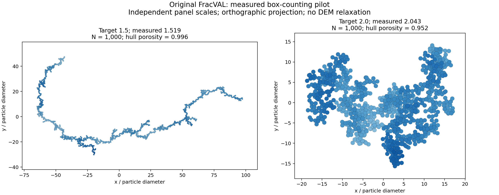
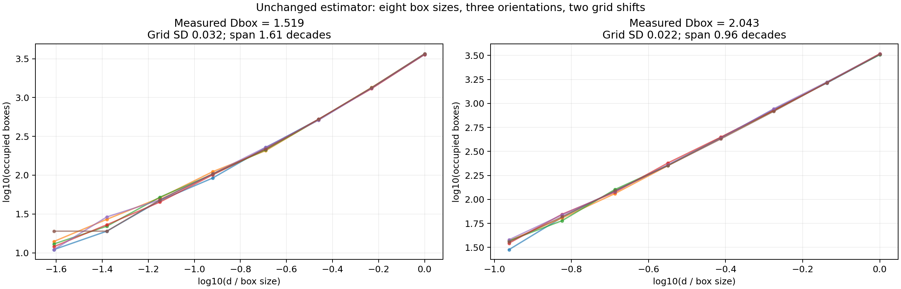

# FracVAL: three measured-dimension targets

This is a generation and characterization pilot, separate from the 359-case ML
dataset. It uses the original FracVAL source with monodisperse particles,
explicit seeds and double-precision compilation on the self-hosted runner.
No DEM relaxation or ML training was performed.

## Achieved measured targets

| Target box dimension | Measured box dimension | Requested mass-radius Df | kf | N | Convex-hull porosity | Grid SD | Scale span (decades) |
|---|---|---|---|---|---|---|---|
| 1.5 | 1.51932 | 1.40 | 1.50 | 1000 | 0.99600 | 0.03230 | 1.610 |
| 2.0 | 2.04253 | 2.10 | 1.20 | 1000 | 0.95192 | 0.02163 | 0.962 |

The tolerance ±0.05 was specified before calibration. The two selected cases pass
connectivity, overlap and the existing box-counting quality checks. Each has
999 contacts and a single connected component. Maximum overlaps are below
1e-12 particle diameters. Grid SD describes grid/orientation sensitivity, not a
confidence interval for a true fractal dimension.

## Target 2.9: not achieved in this pilot

No valid completed FracVAL structure was obtained for the compact target.
Twelve high-dimension candidate settings were attempted: requested Df=2.9 with
kf=0.2,0.3,0.4,0.5,0.6,0.7,0.9,1.0,1.1, and requested Df=3.0 with kf=0.3,0.5,0.7.
Each used N=1000 and Ext_case=1. Nine attempts reached a 120 s generation limit;
the final three denser settings reached 240 s. Low prefactors can fail during
initial subcluster construction; other settings repeatedly fail cluster merging.
Timeouts are not proof of mathematical infeasibility. No third agglomerate is
represented as having measured dimension 2.9, and no unrelated dense packing is
substituted for an original-FracVAL output.

Across the complete pilot: 18 attempts, 6 completed geometries, 12 timeouts.
The two closest completed cases to the lower targets are provided below.
The narrow outcome is that targets 1.5 and 2.0 were reached to ±0.05 with the fixed
box estimator; target 2.9 was not reached. Both generator feasibility and finite-size
box-estimator calibration remain unresolved for the high-dimension target.

## What this establishes

The original FracVAL code can generate geometries near the two lower **measured**
targets after calibration of its **requested mass-radius** parameters. These
parameters must not be reported as measured box dimensions. This is geometric
calibration, not selection based on prediction performance.

The box estimator was not changed: eight sizes from d to L/4, three orientations,
two shifts, occupied boxes intersecting particle bodies. No fitting window was
chosen to force agreement with a desired result.

A diagnostic using simple-cubic arrays of touching spheres returned 2.5088 for
1000 particles and 2.5481 for 8000 particles. These reference structures exhibit
bulk three-dimensional scaling, but the finite-size estimator does not recover
3 at these sizes and fitting scales. In particular, a quality flag of 'ok' does
not prove an unbiased estimate of the asymptotic dimension. This requires further
estimator validation before assigning a physical meaning to a 2.9 target. The
references are not FracVAL output and are not substituted for a pilot case.

## Files

Download and extract `fracval_pilot.zip`. Each selected case includes:
- `particles.csv`: centers and radius in units of particle diameter;
- `particles.vtp`: ParaView point data with radius, in SI units for d=1 um;
- `post_000000000000.txt`: a LAMMPS-format particle dump in SI units;
- `box_curves.csv` and `measurement.json`: full measurements and QA.

In ParaView, open particles.vtp, apply Sphere Glyph, scale by radius with factor 2,
and show all points. There is no geometric-exposure field in this pilot.

All candidate settings and outcomes are in `measurements.json`. See `METHOD.md`
for source provenance, precision settings and measurement conventions. The
source is licensed GPLv3 and retained under `codes/fracval/vendor`.

## Runs

- [First requested-dimension trials](https://github.com/khalifali/PrelimDFG_GNN/actions/runs/35384805269)
- [Measured-dimension calibration](https://github.com/khalifali/PrelimDFG_GNN/actions/runs/35385134121)
- [Denser prefactor trials](https://github.com/khalifali/PrelimDFG_GNN/actions/runs/35385836865)
